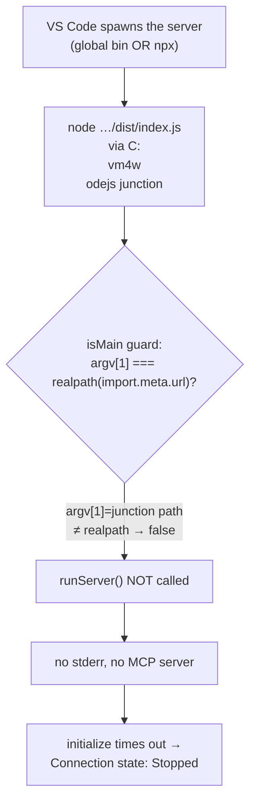

# Bug findings — "Unable to start jira-mcp via global npm install"

> Source recording: `2026-06-30 22-21-10.mp4` (1m 59s, 2560×1600, recorded on Windows).
> Findings written from frame-by-frame inspection of the actual VS Code Output panel
> (not the AI auto-summary, which hallucinated a `MODULE_NOT_FOUND` error that does
> **not** appear in the real logs).
>
> **Update (after follow-up):** the `npx` launch was confirmed to fail identically. That
> evidence revised the root cause away from a Windows `.cmd` stdio-pipe theory to an actual
> bug in the package's own entry-point guard — now **fixed** in `src/index.ts`.

## ⚠️ Security callout (action required first)

The recording shows **live secrets in plaintext** in the user-level `mcp.json`:

- `JIRA_API_TOKEN` (`ATATT3xF…` — full value visible on screen)
- `BITBUCKET_API_TOKEN` (`ATATT3xF…` — full value visible on screen)
- Account email `jerome.gomez@oceantg.com` and tenant `https://oceantg.atlassian.net`

**Recommended:** rotate/revoke the exposed Jira and Bitbucket API tokens, and do **not**
share this `.mp4` outside the team / commit it to a public repo. The full token strings
are intentionally **redacted** below.

## Summary

|                   |                                                                                                                                                                                                                                                                                                                                                                                                                                  |
| ----------------- | -------------------------------------------------------------------------------------------------------------------------------------------------------------------------------------------------------------------------------------------------------------------------------------------------------------------------------------------------------------------------------------------------------------------------------- |
| **Symptom**       | The server starts and serves 36 tools as `node dist/index.js` from the cloned repo, but **fails via every global distribution method** — the global bin (`command: "jira-mcp"`) **and** `npx` (`command: "npx", args: ["-y", "@tugudush/jira-mcp"]`). Both go `Starting → Running → Stopped` with **no server output**.                                                                                                          |
| **Environment**   | Windows, VS Code MCP client, Node via **nvm-for-windows** (`C:\nvm4w\nodejs` is a junction), published package `@tugudush/jira-mcp@1.0.0`.                                                                                                                                                                                                                                                                                       |
| **Root cause**    | A bug in the package's own entry-point guard in `src/index.ts`. It only called `runServer()` when `path.resolve(process.argv[1])` string-matched the module path (or `argv[1]` ended with literal `dist/index.js`). On a symlinked/junctioned global install `argv[1]` ≠ the realpath'd `import.meta.url`, and the `endsWith('dist/index.js')` fallback never matches Windows backslash paths — so the server was never started. |
| **Not the cause** | Not `MODULE_NOT_FOUND` (AI hallucination). Not a `.cmd`/cmd.exe stdio-pipe problem — that first hypothesis is wrong: it would have let Node run and emit stderr, yet there is **zero** server stderr in either failing run.                                                                                                                                                                                                      |
| **Fix**           | **Applied** — replaced the fragile guard with a `realpathSync()`-based entry-point check (`src/index.ts`) that dereferences symlinks on both sides. Republish as **1.0.1** so global-install and `npx` users get the fix.                                                                                                                                                                                                        |

## Environment (read from the recording)

- **Global install** (MINGW64 terminal, frame @ ~0:78):
  ```text
  $ npm install -g @tugudush/jira-mcp
  added 96 packages in 51s
  $ npm ls -g @tugudush/jira-mcp
  C:\nvm4w\nodejs -> .\
  └── @tugudush/jira-mcp@1.0.0
  ```
  → Package is present globally; Node lives under `C:\nvm4w\nodejs` (nvm-for-Windows). That
  path is a **junction** to the active version directory — central to the root cause below.
- **VS Code MCP client** launching stdio servers (Output channel "MCP: …").
- Package facts (`package.json`): `"type": "module"`, `"bin": { "jira-mcp": "dist/index.js" }`,
  entry has a `#!/usr/bin/env node` shebang (`src/index.ts:1`).
- **Published package** (npmjs.com): `@tugudush/jira-mcp@1.0.0`, published 2 days ago. The
  published `dist/index.js` therefore carries the same buggy guard, so both `npm i -g` and
  `npx` pull the broken code — which is exactly why both methods fail.

## Reproduction (as shown)

1. `npm install -g @tugudush/jira-mcp` (succeeds).
2. In a **different** workspace (`keycloak-ui`), the **user-level** `mcp.json`
   (`C:\Users\…\AppData\Roaming\Code\User\mcp.json`) defines:
   ```jsonc
   "jira-mcp": {
     "type": "stdio",
     "command": "jira-mcp",
     "env": {
       "JIRA_BASE_URL": "https://oceantg.atlassian.net",
       "JIRA_EMAIL": "jerome.gomez@oceantg.com",
       "JIRA_API_TOKEN": "ATATT3xF…<redacted>"
     }
   }
   ```
3. Start the `jira-mcp` server from the VS Code Extensions / MCP panel → it goes
   `Starting → Running → Stopped` and never serves any tools.

## Observed behavior — exact logs

### ❌ Failing: global bin (`command: "jira-mcp"`) — Output "MCP: jira-mcp"

```text
2026-06-30 22:19:55.255 [info] Starting server jira-mcp
2026-06-30 22:19:55.256 [info] Connection state: Starting
2026-06-30 22:19:55.336 [info] Starting server from LocalProcess extension host
2026-06-30 22:19:55.349 [info] Connection state: Starting
2026-06-30 22:19:55.350 [info] Connection state: Running
2026-06-30 22:20:00.357 [info] Waiting for server to respond to `initialize` request...
2026-06-30 22:20:04.413 [info] Connection state: Stopped
2026-06-30 22:23:04.102 [info] Starting server jira-mcp
2026-06-30 22:23:04.103 [info] Connection state: Starting
2026-06-30 22:23:04.106 [info] Starting server from LocalProcess extension host
2026-06-30 22:23:04.136 [info] Connection state: Starting
2026-06-30 22:23:04.136 [info] Connection state: Running
2026-06-30 22:23:04.808 [info] Connection state: Stopped
```

- **Attempt 1:** process reaches `Running`, then **times out waiting for the
  `initialize` response** (~9s) and stops.
- **Attempt 2:** process reaches `Running`, then **exits ~0.7s later**.
- **Critically: there is NO `[server stderr]` output at all.**

### ❌ Failing: npx (`command: "npx"`, `args: ["-y", "@tugudush/jira-mcp"]`) — Output "MCP: jira-mcp"

(Second screenshot: the user-level `mcp.json` switched to the npx config.)

```text
2026-06-30 22:48:43.079 [info] Starting server jira-mcp
2026-06-30 22:48:43.080 [info] Connection state: Starting
2026-06-30 22:48:43.080 [info] Starting server from LocalProcess extension host
2026-06-30 22:48:43.106 [info] Connection state: Starting
2026-06-30 22:48:43.107 [info] Connection state: Running
2026-06-30 22:48:48.119 [info] Waiting for server to respond to `initialize` request...
            … same line repeats every ~5s …
2026-06-30 22:49:33.123 [info] Waiting for server to respond to `initialize` request...
2026-06-30 22:49:37.945 [info] Connection state: Stopped
2026-06-30 22:50:04.101 [info] Starting server jira-mcp
2026-06-30 22:50:04.121 [info] Connection state: Running
2026-06-30 22:50:07.195 [info] Connection state: Stopped
```

Same signature as the global bin: `Running` → `initialize` timeout (~54s of polling) →
`Stopped`, **again with zero `[server stderr]`**. Because `npx` resolves and runs the package
differently from the bare-bin `.cmd` shim, this rules out the shim itself and points at what
the two methods share: the **published `dist/index.js` never calls `runServer()`**.

### ✅ Working: local build (`command: "node"`, `args: ["dist/index.js"]`) — Output "MCP: jira-mcp-dist"

```text
2026-06-30 22:22:03.674 [info] Starting server jira-mcp-dist
2026-06-30 22:22:03.674 [info] Connection state: Starting
2026-06-30 22:22:03.675 [info] Starting server from LocalProcess extension host
2026-06-30 22:22:03.705 [info] Connection state: Starting
2026-06-30 22:22:03.705 [info] Connection state: Running
2026-06-30 22:22:04.075 [warning] [server stderr] [jira-mcp] Mode: READS + SCOPED ISSUE UPDATES
2026-06-30 22:22:04.076 [warning] [server stderr] [jira-mcp] Base URL: https://oceantg.atlassian.net
2026-06-30 22:22:04.076 [warning] [server stderr] [jira-mcp] Auth Email: jerome.gomez@oceantg.com
2026-06-30 22:22:04.077 [warning] [server stderr] [jira-mcp] Debug mode enabled
2026-06-30 22:22:04.092 [warning] [server stderr] [jira-mcp] Server successfully connected via stdio
2026-06-30 22:22:04.105 [info] Discovered 36 tools
```

The working config used the repo workspace (`.vscode/mcp.json`, key `jira-mcp-dist`,
`JIRA_DEBUG: "true"`) and discovered **36 tools**.

## Root-cause analysis

The decisive signal is the **total absence of `[server stderr]`** in _both_ failing methods.
The server's startup logging is unconditional and happens **before** any transport work:

- `src/config.ts` → `initializeConfig()` always writes `[jira-mcp] Mode / Base URL /
Auth Email` to **stderr**.
- `runServer()` in `src/index.ts` logs `Server successfully connected via stdio`.

The working `node dist/index.js` run shows all of those lines; the global-bin and npx runs
show **none**. So `runServer()` is never invoked — the entry point loads and then does
nothing. The culprit is the "is this file the entry point?" guard at the bottom of
`src/index.ts`:

```ts
// BEFORE (buggy)
const currentFilePath = fileURLToPath(import.meta.url)
const isMain =
  process.argv[1] &&
  (path.resolve(currentFilePath) === path.resolve(process.argv[1]) ||
    process.argv[1].endsWith('dist/index.js') || // never matches Windows '\' paths
    process.argv[1].endsWith('src/index.ts'))
if (isMain) runServer().catch(/* … */)
```

Why it passes locally but fails for every global method:

| Launch                                                          | `process.argv[1]`                          | `import.meta.url` (realpath)                 | `isMain`               |
| --------------------------------------------------------------- | ------------------------------------------ | -------------------------------------------- | ---------------------- |
| `node dist/index.js` in cloned repo (`C:\htdocs\…`, no symlink) | `C:\htdocs\jira-mcp\dist\index.js`         | same                                         | ✅ true (string match) |
| global bin / npx (install under the `C:\nvm4w\nodejs` junction) | junction path `C:\nvm4w\nodejs\…\index.js` | **realpath** `C:\nvm4w\<version>\…\index.js` | ❌ false               |

Two independent defects combine:

1. **Symlink/junction mismatch.** `path.resolve()` normalizes but does **not** dereference
   symlinks. Node's ESM loader sets `import.meta.url` to the _realpath_ of the module.
   nvm-for-windows exposes Node + global modules through the `C:\nvm4w\nodejs` **junction**,
   so `argv[1]` (junction) ≠ realpath → the equality check fails. The `npx` cache path
   differs the same way.
2. **Backslash fallback bug.** The `endsWith('dist/index.js')` safety net uses a forward
   slash and never matches a Windows path (`…\dist\index.js`).

With both checks false, `runServer()` is skipped, the process produces no output, and VS Code
reports `Running → Stopped` after the `initialize` timeout. This is **not** the `.cmd`/
`cmd.exe` stdio-pipe theory from the first draft: that theory predicted Node _would_ execute
(and emit stderr); the npx run — which fails identically with zero stderr yet does not use the
bare `.cmd` shim — falsifies it.



### The fix (applied)

`src/index.ts` now compares the **realpath of both sides**, which dereferences the junction
and is slash/case agnostic:

```ts
// AFTER (fixed)
function isRunningAsEntryPoint(): boolean {
  const invokedPath = process.argv[1]
  if (!invokedPath) return false
  try {
    return (
      realpathSync(invokedPath) === realpathSync(fileURLToPath(import.meta.url))
    )
  } catch {
    return false
  }
}
if (isRunningAsEntryPoint()) runServer().catch(/* … */)
```

This preserves the intended behavior (don't auto-start when imported by Vitest) while
correctly detecting entry-point launches for `node dist/index.js`, the global bin, `npx`, and
`tsx` dev mode. Validated with `npm run ltfb && npm test` — lint + type-check + build clean,
**98 tests pass**.

## Recommended fixes

### A. Ship the code fix (done in this branch — the only thing that actually resolves the bug)

1. ✅ `src/index.ts` entry-point guard replaced with the `realpathSync()` check above.
2. **Republish as `1.0.1`** (bump `package.json` version + `CHANGELOG.md`). The published
   `1.0.0` carries the broken guard, so **`npm i -g` and `npx` keep failing until a fixed
   version is published** — no client-side `mcp.json` tweak fixes the published `1.0.0`.

### B. Interim workaround until 1.0.1 is published

With the broken `1.0.0`, the only reliable launch is a non-symlinked source build (exactly the
`jira-mcp-dist` config from the recording):

```jsonc
"jira-mcp": {
  "type": "stdio",
  "command": "node",
  "args": ["C:/path/to/cloned/jira-mcp/dist/index.js"], // a real path, NOT under C:\nvm4w\nodejs
  "env": { "JIRA_BASE_URL": "…", "JIRA_EMAIL": "…", "JIRA_API_TOKEN": "…" }
}
```

> Pointing `node` at the **global** install path (`C:\nvm4w\nodejs\…`) does **not** help with
> `1.0.0`, because that path is the junction that triggers the bug.

### C. Documentation follow-up (separate change)

The README/npm "Option 1 — npm global install (recommended)" + `command: "jira-mcp"` snippet
(`README.md` ~L34 and ~L74) is correct **once 1.0.1 ships**. Consider adding a Troubleshooting
entry: "server shows `Starting → Running → Stopped` with no output → update to ≥ 1.0.1".

## Verification checklist

- [x] Reproduce & confirm `npx` also fails (second screenshot).
- [x] Identify root cause in the `src/index.ts` entry-point guard.
- [x] Apply the `realpathSync()` fix; `npm run ltfb && npm test` green (98 tests).
- [ ] Bump version to `1.0.1`, update `CHANGELOG.md`, and `npm publish`.
- [ ] After publish: `npm i -g @tugudush/jira-mcp@latest`, start via `command: "jira-mcp"` →
      expect `[server stderr] … Server successfully connected via stdio` + `Discovered 36 tools`.
- [ ] Re-test the `npx` config end-to-end.
- [ ] **Security:** rotate the Jira + Bitbucket API tokens exposed in the recording; keep the
      `.mp4` out of any public repo.

## Notes / caveats

- **Corrected diagnosis.** The first version of this doc blamed the Windows `.cmd`/`cmd.exe`
  stdio wrapper. The follow-up npx evidence (identical failure, zero stderr, no bare-bin shim)
  disproved that and pointed at the entry-point guard. Lesson: "no server stderr at all" means
  the server code never ran — look upstream of the transport, at the entry-point guard.
- The AI video summary/transcription invented a `Cannot find module …\server-everything` stack
  trace; it does **not** exist in the recording. All log text here was read directly from
  extracted frames.
- `dist/` is a gitignored build artifact; the published npm tarball and the global install each
carry their own built `dist/index.js` (which is why republishing is required).
</content>

</invoke>
